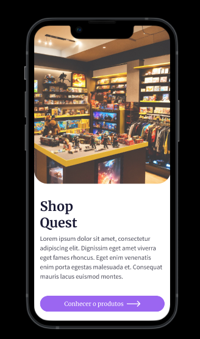
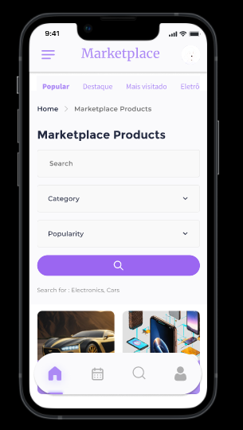

# Report on the development of a navigable prototype in Figma with 4 pages

---

---

Watch how Wireframe works by clicking on the image below

---

## Introduction:

This report covers the process of developing a navigable prototype in Figma with 4 pages, including the creation of a medium fidelity wireframe, the application of List View and/or Grid View to the prototype, the development of components and finalization with a prototype navigable. This project aims to provide an interactive visualization of a user interface, facilitating understanding and validation of the design.

---

## Methods:

1. **Medium-Fidelity Wireframe:**
   - Initially, a medium-fidelity wireframe was created to establish the basic structure of the interface.
   - Key elements were sketched, considering the overall layout and interconnection between different sections.

2. **List View and/or Grid View:**
   - The decision to use List View, Grid View, or both was based on project requirements and the desired user experience.
   - The application of these views aimed to optimize the presentation of information, considering the nature of the content.

3. **Creation of Components:**
   - Components were developed to ensure visual consistency and facilitate future updates.
   - These components included buttons, text fields, icons, among others, ensuring a modular approach.

4. **Navigable Prototype in Figma:**
   - Using the Figma platform, the wireframe was transformed into a navigable prototype.
   - Transitions and interactions were added to simulate the end-user experience.

---

## Results:

The resulting prototype features an intuitive and navigable interface. Design decisions, such as the choice between List View and Grid View, were implemented according to best usability practices. The creation of components contributed to visual cohesion and facilitated design maintenance.

---

## Conclusion:

The development of the navigable prototype in Figma was crucial for visualizing and validating the proposed design. The use of wireframes, the application of different views, and the creation of components demonstrate a systematic approach in the interface design process.

---

## Example Use Case:

Let's consider a task management application where the user can switch between List View and Grid View to view their tasks. In List View, tasks are displayed in a linear list with summarized details, while in Grid View, tasks are presented in a tile layout with more visual information. This provides flexibility to the user, allowing them to choose the view that best suits their needs and preferences.

This example highlights the practical application of design choices in the context of a real use case, aiming to enhance the user experience.
